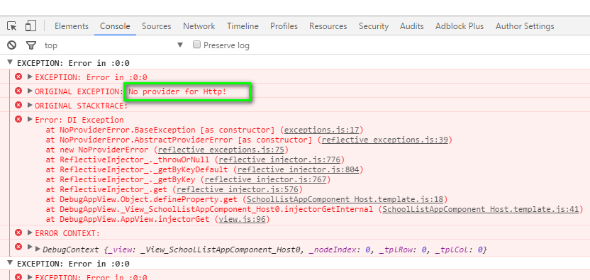
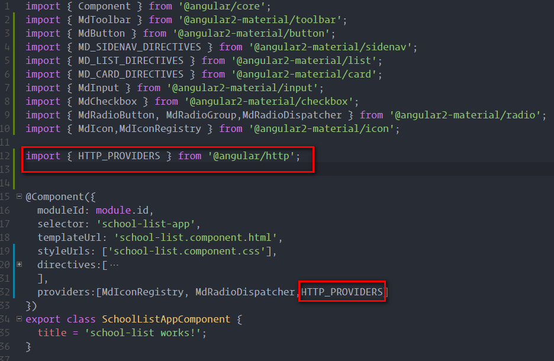

This error is caused by, as you can guess, no Http provider in your ts/js file.

<!--more-->

Here's a screenshot of my error message.

How to fix this? By adding the http provider of course. It's two lines of code.

1. `import { HTTP_PROVIDERS } from '@angular/http';`
2. add `HTTP_PROVIDERS` to your provider list.

