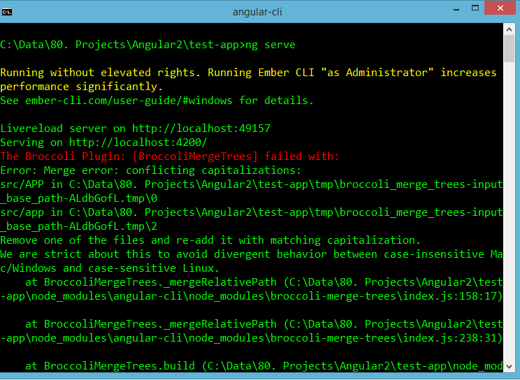

I was running Angular 2 using company computer ( God bless no one from my company see this). And I was starting my app using `ng serve`, but it didn’t work. Instead it threw me an error regarding the Broccoli cannot merge trees.

<!--more-->

I did some digging but it didn’t go anywhere. Then I noticed that the error message saying “running as administrator increases performance significantly.” I just tried to start command line as admin and run the `ng serve` again. Wha-la, the error message disappeared. My app is back online running again.
