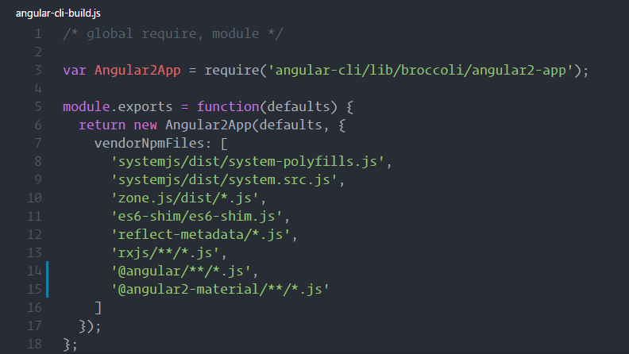
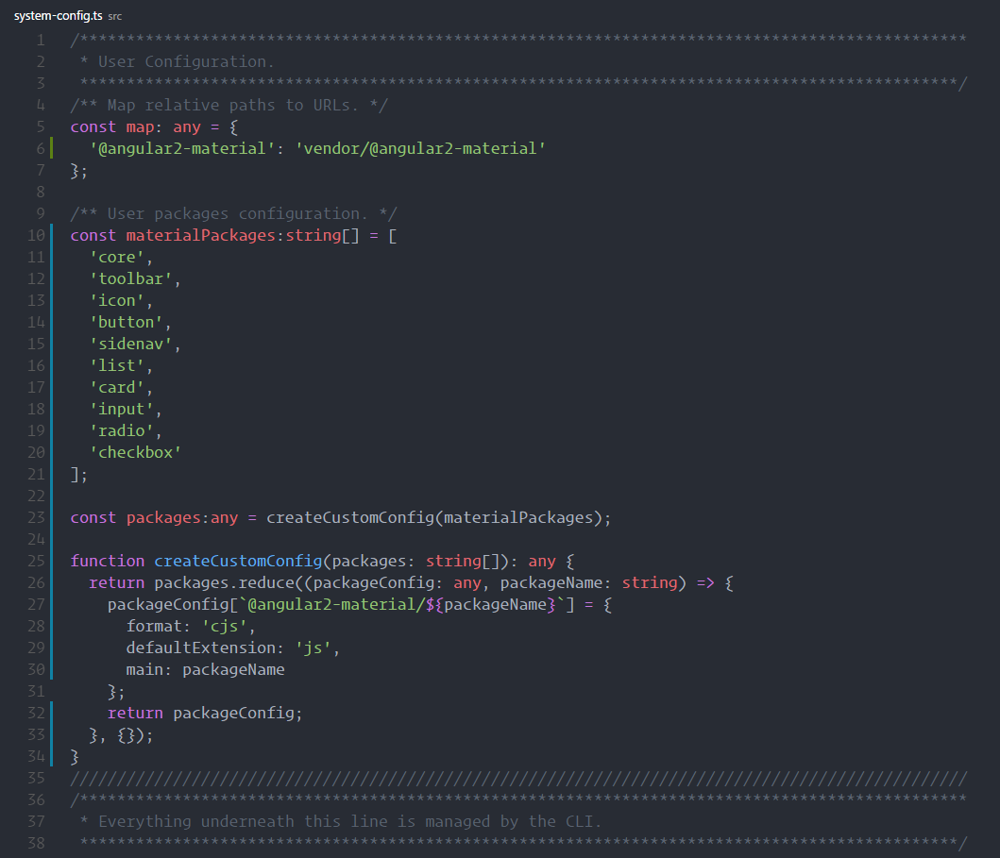

If you have watched the demo of puppy love on ngconf 2016 and pumped to get hands on angualr material 2, trust me, you are **not** alone.

If you try to use angualr cli to create an app and follow along the demo and find out it doesn't work, trust me, you are **not** alone(at least I think so).

If you have the same issue, here's the how to solve it:

<!--more-->

- Change `angular-cli-build.js` in the root folder by adding a line of `'@angular2-material/**/*.js'`

- Change `sytem-config.ts` in the `src` folder by adding material 2 specific settings (on the top).

