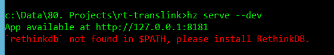
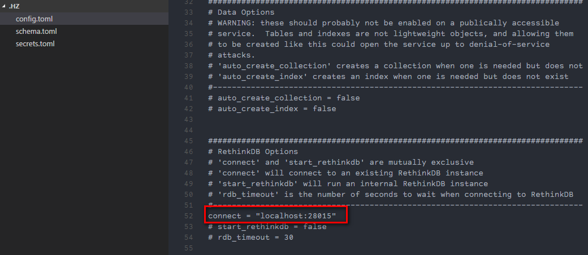

[Horizon](https://horizon.io/) is a realtime JavaScript backend, which is similiar to Firebase. What interested to me is the powerful query language it provides. If you use Firebase before, you will know Firebase is cool as realtime database, but limited by the query ability. So I think it’s worth trying to use Horizon.

<!-- more-->

I followed the step on the website:

1. install RethinkDB by downloading the RethinkDB package
2. install horizon by running `npm i -g horizon`
3. create an app by running `hz init test_app`
4. start the app by running `hz serve --dev`

Here’s the problem I got:

The problem is because Horizon will start RethinkDB by default and in this case it doesn’t know how to start RethinkDB. Because RethinkDB installer doesn’t add the folder path to the environment variable. I tried to manually add this but it was not working. Then I checked the document of Horizon, and found out that Horizon can be configured to Connect to the server, instead of Start a server.

So I changed the `config.toml` file inside `.hz` folder, uncommentted the following line. Then I manually start the RethinkDB server and run `hz serve --dev`. It worked!

Hope it helps someone with the same issue when running Horizon.
