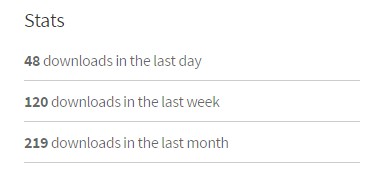

Recently I created my first open source NPM package called `create-webpack-config`. As you can guess, this is to create a [webpack](https://webpack.github.io/) configuration file (`webpack.config.js`), via CLI.

<!--more-->

Basically it’s a command line tool which will generate an app structure for you to start using [webpack](https://webpack.github.io/) in no time.

As to today, this module has been downloaded less than 300 times. It’s a very small number, but for me it’s quite big!

If you like to use [webpack](https://webpack.github.io/) , try this tool. If you like the tool, star it on [github](https://github.com/zhaoshengjun/webpack-config). It really motivates me!

## How to use

1. Install the package via `npm i -g create-webpack-config`
2. Create app by run `webpack-config init`

You now have a working directory to start! You can run `npm i` to install dependencies and then rurn `npm start` to start 🚀 !

## Why?

Lots of people cannot figure out how to make [webpack](https://webpack.github.io/) work. But some people are also working on this to make it easier to use, with different approaches:

- boilerplate
- better documents(especially @TheLarkInn, @sokra and other team members)
- … …

With the popularize of Create-React-App (CRA), I think it’s worth another shot by building a CLI tools to provide single command to get started with webpack.

After all, webpack is a GREAT tool and we all love it 💕 💕 💕 !