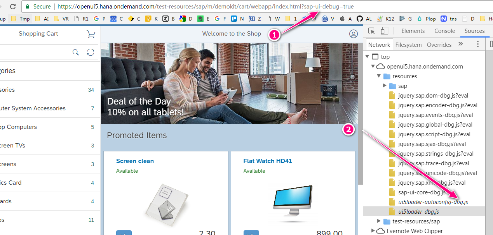
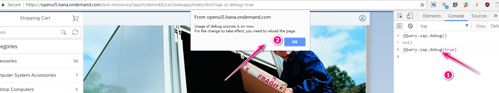
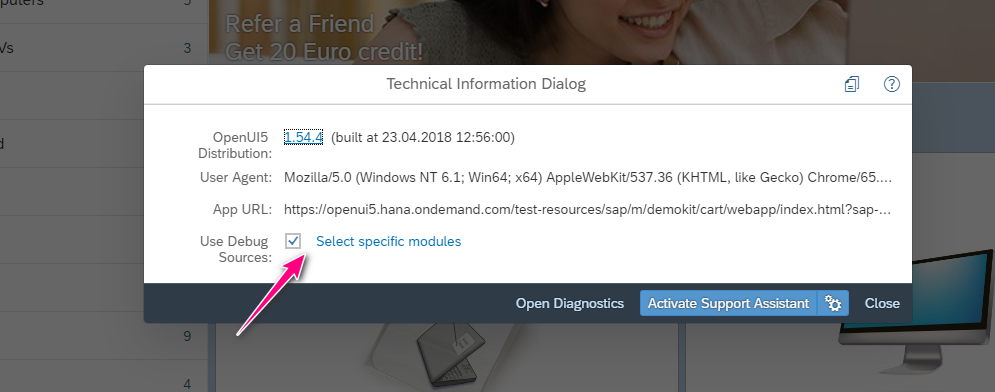

## Ways to Debug a SAPUI5 Apps

There are 2 ways to debug a SAPUI5 apps:

- Use browser's debugger tools
- Use SAPUI5 debug mode

Which way you choose to use is depending on whether you have the source files, which are un-minified version. If you have source files, the browser debugger is a better option whereas SAPUI5 debug mode is more suitable for minified files.

Here, we are discussing the second option.

## Start with Debug Mode

### Use Flag

To run SAPUI5 apps in debug mode, you can add a `sap-ui-debug=x` at the end of the url.



### Set Manually using JavaScript

At the console, you can simply run the following code to enable the debug mode:

```javascript
jQuery.sap.debug(true);
```



### Use Keyboard Shortcut

If you press `Ctrl + Shift + Alt + P`, you will see a popup window, which has an option to run it in debug mode.



## Behind the Scene

In debug mode, SAP load the file with the `-dbg.js`, which are un-minified version of the JS source files.

And these files are generated automatically by SAP when you deploy the SAPUI5 apps.
