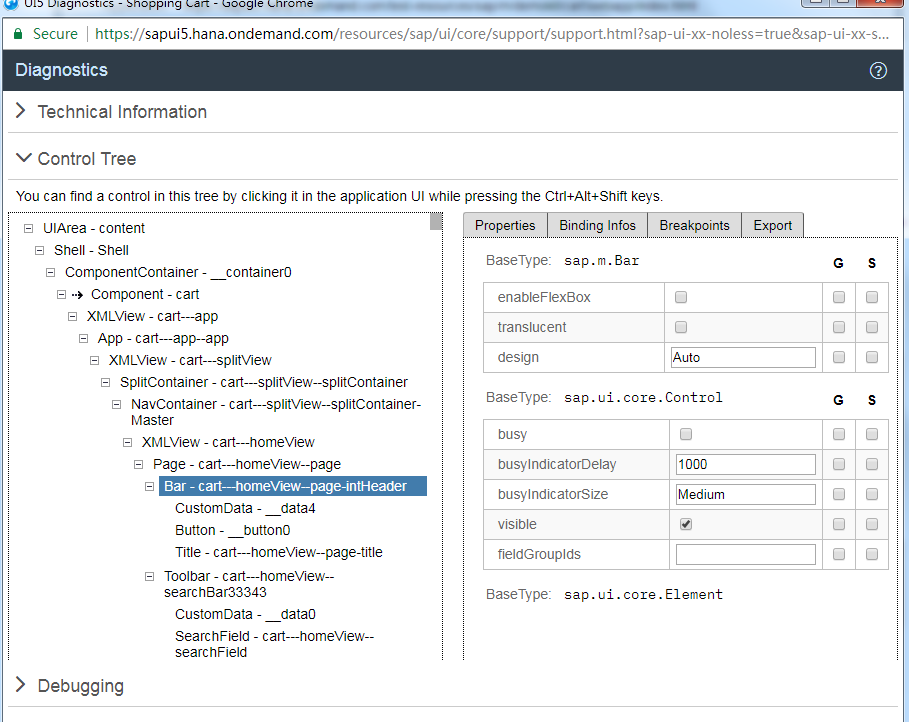

## What's Diagnostic Tool

Diagnostic tool is provided by SAPUI5 to improve the productivity for developers, available both for desktop and mobile.

With this tool, you can check:

- Technical information
- Control tree
- Debugging
- JavaScript Trace
- XML View and Templating Support Tools
- Interaction
- Performance

### Technical Information

As you can see from the above screenshot, in 'Technical Information' part, you can see the overview of the technical parts of the running SAPUI5 app. Mostly the JS version, but also you can enable the 'Debug Mode'.

With this, you can quickly check if the file version is wrong.

### Control Tree

This might be the highlight of this tool.

In this part, you can see how the components are integrated with each other. And you can find the control by placing this page and the application side by side and clicking the control while pressing `Ctrl+Alt+Shift`.

If there's something wrong with the control structure, you can easily find it with this tool.

### Debugging

Honestly, I think this is less useful, at least for me, I am a big fan of **Chrome Developer Tool**.

You can use a different version of UI5 to reload the app, and also set breakpoint for a class method. But you can easily do it using Chrome Developer Tool.

### Others

Other parts of the diagnostic tool are also less useful.

## Enable Diagnostic Tool

### On Desktop

To show the diagnostic tool, you need to press `Ctrl + Shift + Alt + S`.

### On Mobile

In mobile version, you have to press 2 fingers on screen area for at least 3 seconds and then tap the 3rd finger. Wired, right?
