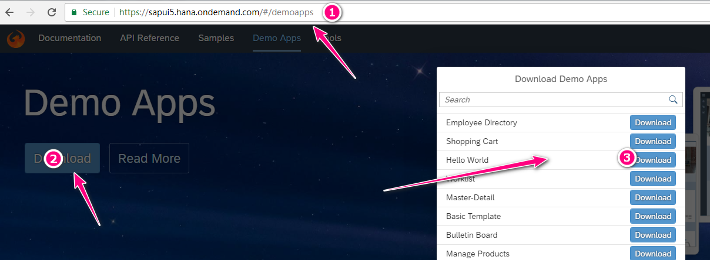

## Why Use Webpack

`Webpack` is a great tool for web development. And I've use it in almost all of my projects ever since I found it in 2016. I even wrote some blogs in my another [blog](http://samzhao.gitlab.io/).

In short, `webpack` is a bundle tool for web developers, and what makes it special is that it can bundle **EVERYTHING**. Not just `js` files, but **EVERYTHING**.

You can check it's official [website](https://webpack.js.org/) for more details.

Today, I want to show you how to use `webpak` in your SAPUI5 project.

## Use Webpack

### Prerequisites

You can install `webpack` in 2 ways:

1. **Globally**: means that you can install it once, and use it anytime/anywhere you want. But the downside is version compatibility. Some projects may need a lower version, but if you install a higher version globally, it won't work for those projects.
2. **Locally**: means every project can have it's own version of `webpack`. It certainly will not have any compatibility issue. But as you can think, the downside is it may take more space. And if you want to update `webpack`, you have to do it project by project.

In this series blogs (Yes, I intend to write more in the future, includes but not limited to show you how to use `webpack` to do **bundling**, **performance tuning**, **code-splitting**, even **tree shaking**.), I will use wepack locally, following the standard `node.js` project settings.

### Download Example Project



To start, let's create a folder named `ui5_pack`, and download the `Hello World` example SAPUI5 project from SAPUI5 demo site by following the below steps:

- Goto [demo site](https://sapui5.hana.ondemand.com/#/demoapps)
- Click `Download` button
- In the pop up list, find the `Hello World` and click `download` button
- After file has been downloaded, extract the content into our `ui5_pack` folder
- Also grab a copy of the `SAPUI5`/`OpenUI5` lib files
- Create a folder called `resources` and put the lib files in this folder
- Change the `index.html` file to point the `sap-ui-core.js` to our new location `./resources/sap-ui-core.js`

You can check to see it's working by double clicking the `index.html`.

### Generate Project Settings

Assume you have already installed `node.js` and `yarn`on your development machine, the first step we need to do is to generate a `package.json` file to store all our project settings.

Open you terminal, and input the following command under the `ui5_pack` folder:

```bash
yarn init -y
```

You will get a `package.json` file which contains all the default settings, something like this:

```json
{
  "name": "ui5_pack",
  "version": "1.0.0",
  "main": "index.js",
  "author": "Sam Zhao <zhao.shengjun@gmail.com> (https://zhaoshengjun.gitlab.io/)",
  "license": "MIT"
}
```

### Add Webpack

`Webpack` will be added as an development dependency, so is the `webpack-cli`.

In order to do this, we need to run the following command in the terminal:

```bash
yarn add -D webpack webpack-cli
```

`Yarn` will do a calculation based on all the dependencies we have specified in `package.json` file to determin the best version we need to install. But our example is simple because we have no other dependencies, so it will install the latest versions. If you look closely, you will see the following lines have been added to `package.json` file.

```json
{
  ...
  "dependencies": {},
  "devDependencies": {
    "webpack-cli": "2.1.2",
    "webpack": "4.6.0"
  }
  ...
}
```

### Rebundle Files

Using `webpack`, we can bundle the files we use. Let's start with the `js` file. But first we need to make some changes.

First, we need to move the JavaScript inside the`index.html` to a external file. In the second `<script>` tag, there are some code. We need to cut and copy it to a file named `main.js` and put it under a new new folder called `src`.

Then, we need to write a configuration file to tell `webpack` how we want it to work on our files. So create a file called `webpack.config.js` and put it in the root folder (not the `src` folder). The content of this `webpack.config.js` file is like this:

```javascript
const path = require("path");

module.exports = {
  entry: "./src/main.js",
  output: {
    path: path.resolve(__dirname, "dist"),
    filename: "bundle.js"
  }
};
```

This file is a copy of the configuration file you can find on `webpack.js.org` front page and it's the basics.

- `entry` part tells where we want `webpack` to start, as the entry point.
- `output` part tells what we want `webpack` to output our generated files. In this example, we tell it the generated file should be named `bundle.js` and we'd like it to be placed under folder `dist`. (Don't worry if we haven't create the `dist` folder yet. `Webpack` is smart enough to create it automatically for us if there's no such folder).

We also need to modify the `index.html` to use the new `js` file, but not directly using the `src/main.js`. We will use the generated file in the `dist` folder. The updated `index.html` file should look like the following:

```html
<!DOCTYPE html>
<html>

<head>
	<meta http-equiv="X-UA-Compatible" content="IE=edge">
	<meta charset="utf-8">
	<title>Hello World App</title>
	<script id="sap-ui-bootstrap" src="./resources/sap-ui-core.js" data-sap-ui-theme="sap_belize" data-sap-ui-libs="sap.m" data-sap-ui-preload="async">
	</script>
	<script src="/dist/bundle.js">
	</script>
</head>

<body class="sapUiBody" id="content">
</body>

</html>
```

The changes we've done so far is enough to make it running. So in your terminal, run the following commands:

```bash
webpack
```

You should see the `dist` folder is being created and the `bundle.js` is available. Then open the `index.html` file, and you should be able to see the app working as before.

Hooray! We made it! We can use the `webpack` with our SAPUI5 project from now on.

If you have trouble following along, you can check the github repo I created for this blog: [`ui5_pack`](https://github.com/zhaoshengjun/ui5_pack)

## Next Step

In next blog, I plan to show you how to use `webpack-dev-server` to enable great features like live-reloading etc.

Stay tuned!
